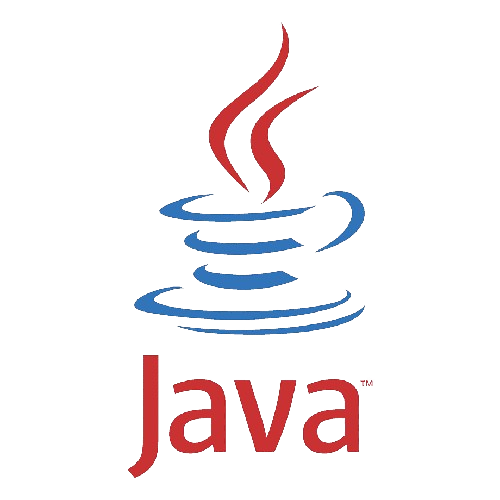
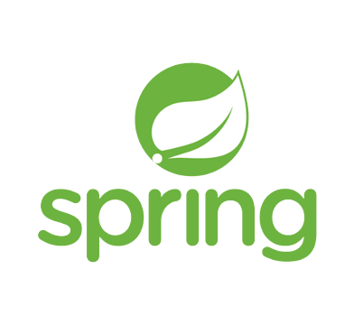
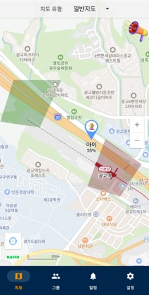
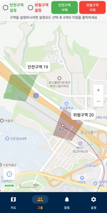
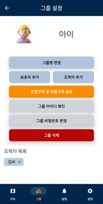
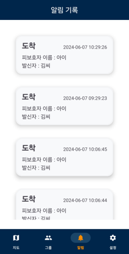
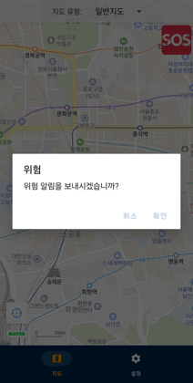
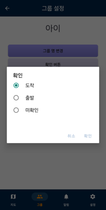
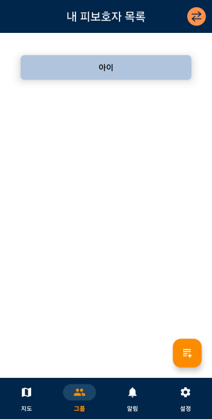
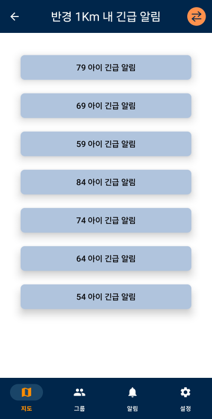

  
  <h1>SafeGuard</h1>
  
  

    본 프로젝트는 경기대학교 2024학년도 1학기 컴퓨터공학심화캡스톤디자인 수업을 통해 수행한 팀프로젝트입니다.
  

  

 
  

## :star2: About the Project

### 📃: Tech Stack
|   Java   |   Android SDK  |  Spring Boot  | Firebase | Retrofit | NaverMap API |
| :------: | :------------: | :-----------: | :------: | :------: | :----------: |
|   |  |  |  |  |  |

 

### :dart: Features

- 보호자와 피보호자간의 실시간 위치 공유
- 피보호자의 안전 및 위험 구역를 사용자가 원하는 4개의 지점을 직접 선택하여 설정
- 피보호자의 구역 변경 시 보호자에게 실시간 알림 전송
- 핼퍼가 피보호자의 도착, 출발, 미확인 상태를 보호자에게 알림
- 피보호자의 긴급 상황 발생 시, 보호자에게 SOS 요청

 

### :camera: Screenshots

|   지도 페이지   |   안전 및 위험 구역 설정   |  그룹 페이지   |  알림 페이지  |
| :-------------: | :-------------------------: | :------------: | :------------: |
|  |  |  |  |
| GPS를 통한 사용자간 위치 공유 | 4개의 지점를 선택하여 구역을 설정 | 그룹 내 상세 설정 | 수신한 알림 내역  |

 

|   피보호자 SOS   |   핼퍼 Confirm   |  내 피보호자 목록  |  주변 긴급 알림  |
| :--------------: | :-------------------------: | :------------: | :------------: |
|  |  |  |  |
| 피보호자 긴급 상황 시 위험 알림 | 헬퍼의 피보호자 확인 알림 전송 기능 | 피보호자의 그룹 리스트 | 반경 1Km 이내의 실종 미아 알림 게시판 |

 

### :two_men_holding_hands: Team Member
- 경기대학교 컴퓨터공학부 안재홍
- 경기대학교 컴퓨터공학부 김영중
- 경기대학교 컴퓨터공학부 이신행
- 경기대학교 컴퓨터공학부 조민환
- 경기대학교 컴퓨터공학부 홍승민
- 경기대학교 컴퓨터공학부 찐티응엣

  
